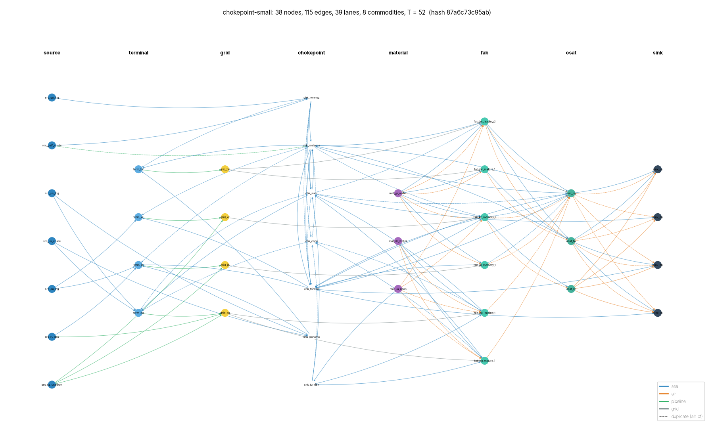
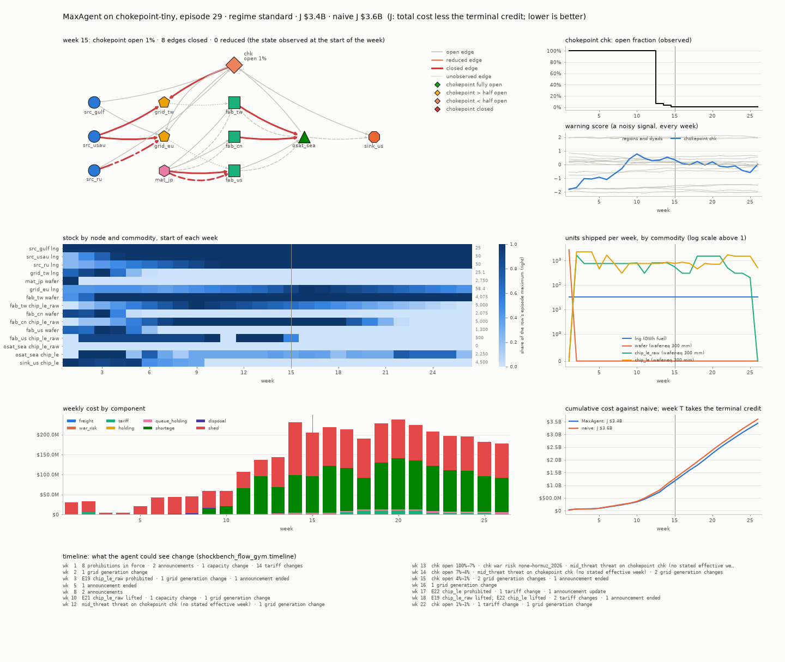

# ShockBench-Flow starter kit

**A Gymnasium control task: keep a supply network running while the map breaks.**

[](https://www.python.org/)
[](https://gymnasium.farama.org/)
[](LICENSE)

Every week of an episode you decide how much of each good to send along each route of a network: fuel to power grids,
wafers to chip factories, chips to markets. Some routes pass through sea straits. Before the episode starts, random
disruptions are drawn, and nothing you do changes them: a strait closes, a route is sanctioned, a tariff jumps, a
factory goes down. You see the network as it is this week, your stock and your shipments, a demand forecast, and noisy
early warnings and announcements (some of them false alarms). An episode costs money (freight, tariffs, storage,
unmet demand); lower is better.

Your **score** compares your cost with two reference players on the same scenarios: **0** is the naive rule (keep
shipping the normal plan, ignore disruptions), **1** is the clairvoyant plan (a plan that knew every disruption in
advance), and below 0 is worse than naive. You do not need to know anything about supply chains: treat it as a regular
gym task and try RL, control, search or evolved policies. The [glossary](#glossary) explains the few terms the tools
use.



## Install and update

You need git and [uv](https://docs.astral.sh/uv/getting-started/installation/).

```bash
git clone <this repository's URL> shockbench-flow-starter
cd shockbench-flow-starter
uv sync                 # or `make install`; `uv sync --extra rl` (make install_rl) adds PPO (Stable-Baselines3, PyTorch)
```

Run every command from the repository's root. `make` shortens the common ones (the [Makefile](Makefile) lists them).
Optionally copy `.env.example` to `.env` (log level, Codabench credentials); it is gitignored. The first run of
anything is slow while Python compiles the packages; later runs start much faster.

The benchmark itself is the wheel in [vendor/](vendor/), which uv installs from there and only from there. When the
organisers ship a fix, it arrives as a new wheel in this repository: **`make update`** pulls it (`git pull`; a conflict
in `uv.lock` alone, from dependencies of your own, is resolved by taking the organisers' lock and relocking), resyncs
the environment (keeping the rl extra if you had it) and runs `sbf version`, which says whether you are up to date.
[CHANGELOG.md](CHANGELOG.md) lists the releases.

## Who owns what

The repository is split so that `make update` never touches your work:

| Yours (the organisers never edit these) | The organisers' (edits here conflict at the next update) |
| --- | --- |
| `agents/`: one folder per submission (`make new-agent NAME=mine`) | `vendor/`: the benchmark's wheel |
| `my/`: your package: `my/scripts/` (your experiments), `my/configs/` (their Hydra configs, and your variants of the examples'), `my/tests/` (collected by `uv run pytest`) | `src/sbf_starter/`, `scripts/python/0N_*.py`, `configs/` (main, hydra, task, the examples'), `tests/`, `docs/` |
| `[dependency-groups] mine` in `pyproject.toml` (`uv add --group mine <package>`) | `README.md`, `AGENTS.md`, `Makefile`, `CHANGELOG.md`, the rest of `pyproject.toml` |
| `outputs/` (gitignored run folders), `.env` | |

`sbf` looks an agent's name up in `agents/` first, then among the shipped ones (`template`, `random`, `heuristic`), so
`uv run sbf check mine` finds `agents/mine/`. Every Hydra entry point also finds the configs in `my/configs/`: a
variant of an example is a file of yours (`my/configs/my_search.yaml` with `defaults: [06_policy_search, _self_]`),
run with `uv run python scripts/python/06_policy_search.py --config-name=my_search`.

## Quick start

```python
import gymnasium as gym
import shockbench_flow_gym  # registers the ShockBench/* environments

env = gym.make("ShockBench/Tiny-v0")
obs, info = env.reset(options={"episode": 0})                    # dev episode 0: the same index, the same scenario
done = False
while not done:
    action = env.action_space.sample()                           # {"flows", "override_qty", "release_mode"}
    obs, reward, terminated, truncated, info = env.step(action)  # reward = minus this week's cost (USD)
    done = terminated or truncated
```

Or run it: `uv run python scripts/python/01_quickstart.py` (`make quickstart`).

## The three networks

| Environment | Role | Nodes | Edges | Goods | Straits | Weeks | `flows` slots |
| --- | --- | --- | --- | --- | --- | --- | --- |
| `ShockBench/Tiny-v0` | practice, seconds per episode; the tools' default | 12 | 25 | 4 | 1 | 26 | 20 |
| `ShockBench/Small-v0` | **the public board** | 38 | 115 | 8 | 7 | 52 | 108 |
| `ShockBench/Full-v0` | **the private board** | 72 | 369 | 8 | 7 | 104 | 395 |

The scenarios of the public generator are the same for everyone: `reset(options={"episode": n})` plays dev episode `n`
of the local evaluation, and `gym.make(..., entropy=<any integer>)` gives you a training root of your own. Start on
Tiny, then move to Small (`--task=small` on `sbf`, `task=small` on an example): an agent must read every shape from
its `config`, since the sizes differ.

## What you control and what you see

- **Action**, a dict of arrays: `flows` (how much to send on each route this week, from 0 up), and optionally
  `override_qty` and `release_mode` (how tankers queued at a strait leave: 0 the default rule, 1 your quantities,
  2 hold).
- **Observation**, a dict of arrays keyed by name: stock, backlog, goods in transit, the network this week (capacity,
  cost, lead time, sanctions and tariffs per route, how open each strait is), last week's costs, the demand forecast,
  early-warning scores and announcements. Each field `x` has a mask `x.observed`. `action_mask` marks the routes you
  may use this week.
- **Reward**: minus the week's cost in USD; an episode's return is minus its total cost. Weeks cost millions to
  billions of USD, so for RL use the `ScaleReward` wrapper.

[docs/GUIDE.md](docs/GUIDE.md) has the details: the fields, the RL wrappers, the rules and how the score is computed.

## Your agent is one class

A submission is a zip with `agent.py` at its root:

```python
import numpy as np

class Agent:
    def __init__(self, config=None):   # once per episode
        u0 = config["static"]["edges"]["u0"]
        self.cap = np.array([u0[e] for e in config["static"]["action_slots"]["edge"]])

    def act(self, observation):        # once per week
        return {"flows": self.cap * observation["action_mask"]}  # send the maximum on every allowed route
```

`make new-agent NAME=mine` copies the [template](src/sbf_starter/agents/template/agent.py) to `agents/mine/`; edit
its `act`. The same class runs under gymnasium (examples 02 and 03 show how), in the local evaluation and on the
server. Files it loads (weights, tables) go in its folder, which git commits.

## Score locally, then submit

```bash
uv run sbf evaluate mine                     # the score on Tiny's 20 dev episodes, with an interval (make evaluate)
uv run sbf compare mine template             # did the change help? a paired interval (make compare A=mine)
uv run sbf check mine --task=small           # the server's checks and a timed run (make check)
uv run sbf pack mine                         # -> outputs/mine.zip (make pack)
uv run sbf upload outputs/mine.zip           # to Codabench, with your own account (make upload)
```

| Step | Command | What it does |
| --- | --- | --- |
| score | `sbf evaluate <agent>` | your score (0 = naive rule, 1 = clairvoyant plan) on the 20 dev episodes, its 90 % interval, the mean costs in USD and the weeks naive played for you; the first run on a network computes the references and caches them (`--quick` for seconds, not the board's numbers) |
| compare | `sbf compare <a> <b>` | both on the same episodes: the difference and its paired interval, which tells whether a change is real |
| check | `sbf check <agent, folder or zip>` | the server's own zip validator, every file's imports against the scoring image, and a timed run in a process that holds only the scoring image's packages; exit status 1 when the server could not run it (`--docker`: a local copy of the scoring container, with its CPU meter) |
| pack | `sbf pack <agent or folder>` | a zip with repeatable bytes, checked |
| upload | `sbf upload <zip>` | the web page's upload, scripted (`--dry_run` to rehearse, `--wait` to get the score) |
| status | `sbf status [id]` | your submissions and their scores |
| runs | `sbf runs` | the example runs under `outputs/`, with their results |
| version | `sbf version` | the installed benchmark against this repository's wheel |

Every command takes `--task=tiny|small|full` (default tiny); `evaluate` and `compare` share `--episodes` (dev, a count
or a list), `--quick`, `--entropy` (a root of your own) and `--cpu_budget` (a week over the task's CPU budget is played
by the naive rule, as on the server). `upload` and `status` use your Codabench credentials from the environment only
(`CODABENCH_TOKEN`, or `CODABENCH_USERNAME` and `CODABENCH_PASSWORD`, from your shell or `.env`) and never print or
store them; name the competition with `--competition=<its URL>` or `CODABENCH_COMPETITION`. They make the same
requests as the web page, never retry a refusal, and each upload uses one of your daily submissions. The web page works
just as well.

## Examples

Each example is a Hydra entry point, `scripts/python/0N_name.py`, with its settings in `configs/0N_name.yaml`; any
setting can be changed on the command line (`episodes=6`, `task=small`). Each runs on Tiny by default and writes its
run folder `outputs/<script>/<run_name>/` (`config.yaml`, `meta.json` with the wheel's version, the git commit and the
results; `run_name=baseline` names it, `sbf runs` lists them). `quick=true` means what `--quick` means for `sbf`.

| Example | What it shows | Tiny, first run / later |
| --- | --- | --- |
| [01_quickstart.py](scripts/python/01_quickstart.py) | the gymnasium loop with random actions, on dev episode 0 (`reset(options={"episode": 0})`) | seconds |
| [02_play_agents.py](scripts/python/02_play_agents.py) | the `Agent` format, played under gymnasium as the scorer plays it (random against send-the-maximum) | seconds |
| [03_heuristic_agent.py](scripts/python/03_heuristic_agent.py) | a rule that reads the straits' state, against send-the-maximum on the dev episodes where a strait closes, the difference in USD | about 15 s |
| [04_evaluate.py](scripts/python/04_evaluate.py) | `sbf evaluate` and `sbf compare` from Python (the same function, the same defaults) | about a minute / seconds |
| [05_train_ppo.py](scripts/python/05_train_ppo.py) | PPO (Stable-Baselines3) exported as a TorchScript submission (`--extra rl`) | about a minute |
| [06_policy_search.py](scripts/python/06_policy_search.py) | an evolutionary search over a parametric policy on cached references, under the CPU budget; where an LLM proposer plugs in; writes its best only if it beats the start on held-out episodes | about 2 minutes / 1 minute |
| [07_dashboard.py](scripts/python/07_dashboard.py) | the network map, episode dashboards and a GIF | about 30 s / 15 s |

The first-run times were measured on an Apple M4 Pro laptop (12 cores) with an empty cache: 04, 06 and 07 first
compute the naive rule's model and the references of their episodes (06: 16 training and 20 held-out episodes, about 50
s), then reuse them from the cache. On Small and Full the first run takes minutes to tens of minutes (docs/GUIDE.md,
"Local evaluation").

The reusable code is in [src/sbf_starter/](src/sbf_starter/): agent names (`agents`), the `sbf` command line (`cli`),
scoring on cached references (`scoring`), the isolated check (`check`), the pieces of the policy search (`search`) and
of PPO (`ppo`), the run folders (`runs`).



## Reference scores

Scores (0 = naive rule, 1 = clairvoyant plan) under the scored information regime (`standard`), measured by the
organisers. On Small and Full the order-up-to and random samples score **below naive**: "send the maximum" is the
baseline to beat there.

| Entry | Tiny, dev split (20 episodes) | Small, 120 episodes | Full, 120 episodes |
| --- | --- | --- | --- |
| clairvoyant plan | 1 | 1 | 1 |
| `mpc_det` (the package's rolling-horizon LP) | 0.899 | 0.7050 | 0.3714 |
| `mpc_scen` (the same over 8 sampled futures) | 0.878 | 0.7193 | 0.4052 |
| send the maximum ([template](src/sbf_starter/agents/template/agent.py)) | 0.756 | 0.4281 | 0.3309 |
| PPO, 95 minutes of training (Tiny only) | 0.622 | not measured | not measured |
| `greedy_lp` (a one-week LP) | -0.220 | 0.3122 | 0.1882 |
| order-up-to sample (a stock-cover rule, not the heuristic agent) | 0.259 | -1.8993 | -2.1464 |
| random sample | 0.239 | -0.4695 | -2.2392 |
| naive rule | 0 | 0 | 0 |

**How these reference scores were measured.** The organisers ran each entry on their scoring host (Linux x86_64)
through the same scoring code as the leaderboard. Tiny's column is the public dev split (5 episodes per harm level), so
`uv run sbf evaluate template` reproduces send-the-maximum's 0.756; PPO's 0.622 was scored before a later fix moved
the naive rule's cost on one dev episode, so a re-run can differ slightly. Small's and Full's columns come from a pilot
on 30 private episodes per harm level, not the public dev episodes: nothing is measured on the public dev episodes of
Small and Full yet. On 20 episodes one standard error of a score is 0.17 to 0.20 (the random and order-up-to samples,
on Tiny), so small differences mean little: compare two agents with `sbf compare`.

## Glossary

- **Naive rule** (score 0): keep shipping the normal plan every week and ignore disruptions. It sees no warnings. A week
  your agent cannot play (an exception, a malformed action, over the CPU budget) is played by the naive rule instead.
- **Clairvoyant plan** (score 1; "the oracle" in the package's code): a linear program that knows the whole scenario in
  advance, disruptions included, and plans the cheapest shipments. No agent can beat it on average.
- **Score** ("RSS", the Resilience Skill Score, in the package and on the board): the share of the saving from naive to
  the clairvoyant plan that your agent achieves, summed over episodes. Below 0 is not clipped.
- **Harm level** (1 calmest to 4 most harmful): how much damage an episode's disruptions would do to the normal plan.
  The dev split holds 5 episodes of each; the board weights them 50 %, 30 %, 15 %, 5 %, the generator's own mix.
- **Dev split**: the 20 public episodes `sbf evaluate` uses by default (`--episodes=dev`). The boards score private
  episodes drawn by the same rule.
- **Root** (`entropy`): the seed of a set of scenarios. 0 is the public dev root; any other integer gives scenarios of
  your own to train and tune on.

## Rules

The rules that decide a score (the packages the server has, the CPU budgets, the seeding, the size limits, the boards
and the submission limits) are stated once, in [docs/GUIDE.md](docs/GUIDE.md#rules). The dates are on the competition
page.

## Where to go deeper

- [docs/GUIDE.md](docs/GUIDE.md): the observation and action, the RL wrappers, the rules, how the score is computed,
  local evaluation and its noise, and (optional) the supply-chain story behind the network.
- [src/sbf_starter/agents/template/agent.py](src/sbf_starter/agents/template/agent.py): the submission template.
- [AGENTS.md](AGENTS.md): the task, the layout, the commands and the rules, for you and for a coding assistant.
- `help()` works on everything: `shockbench_flow_gym.wrappers`, `shockbench_flow_agent.EpisodeSet`.

## FAQ

**Do I need to know supply chains or RL?** No. It is an episodic control problem with a dict observation and a dict
action. A good first step is to beat "send the maximum" on Small.

**Which network is scored?** The public board plays Small, the private board Full (docs/GUIDE.md, "Rules").

**Which packages can my agent use?** On the server: Python 3.13's standard library, numpy, SciPy and PyTorch (CPU).
Nothing else, and no network. Train with anything, then ship weights and plain numpy or torch code. `sbf check` fails
an agent whose imports the server lacks, in `agent.py` or in any module it imports.

**How can I avoid overfitting the 20 dev episodes?** Train and tune on your own root (`gym.make(..., entropy=12345)`,
`uv run sbf evaluate mine --entropy=12345 --episodes=64`) and use the dev episodes to confirm, with `sbf compare`.

**My agent crashes on Small but not on Tiny.** Read shapes from `config["spaces"]`, and note that on Small and Full the
queue at the straits is one dense table (`queue_lots.qty`, rows `config["layout"]["lot_keys"]`); the per-lot lists of
Tiny do not exist there (docs/GUIDE.md, "Small and Full").

**Where do I ask questions?** On the competition's forum.

## Licence

MIT, see [LICENSE](LICENSE). The vendored shockbench-flow wheel is MIT too; its licence and third-party notices (code
derived from NumPy, and the data sources behind the networks) are inside the wheel, under
`shockbench_flow-*.dist-info/licenses/`.
